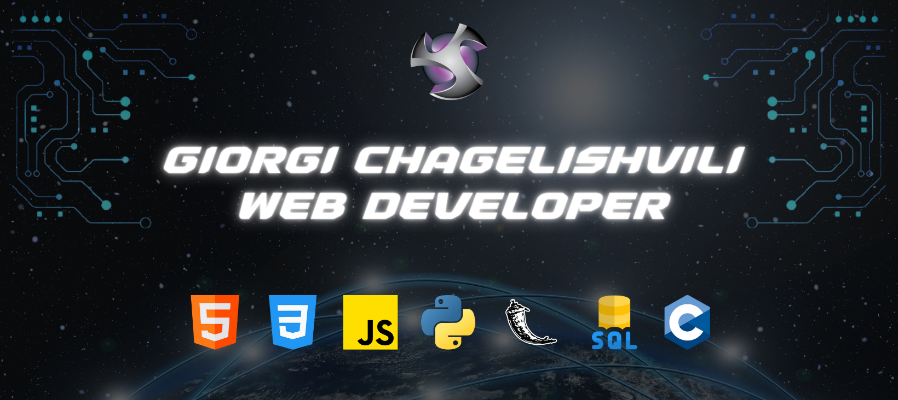

<h1 align="center">Hi 👋, I'm Gio</h1>
<h3 align="center">
  A passionate full stack developer from Georgia 
  
</h3> 

 I am web developer from Georgia, produced more than 30 web applications during my up-and-coming career. With my skills, I want to contribute to companies/individuals that are determined to leave a positive mark on the world. I envision myself in a team full of people with the same purpose as me, grinding day and night to spread an idea that will make living on earth easier and happier. 

          

 Currently working as full-stack developer on online casino project. My role is to implement gambling games (e.g. roulette, card games, slots etc.) from scratch, maintain and optimize them according to company's needs. I'm using HTML&CSS to create interface, jQuery, PHP and MySQL to make the website functional. 

&nbsp;

